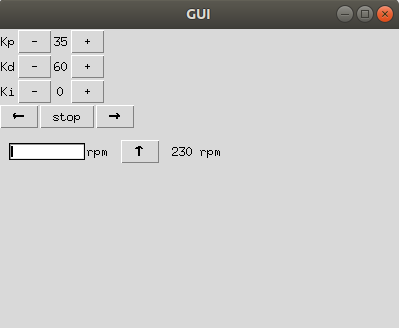
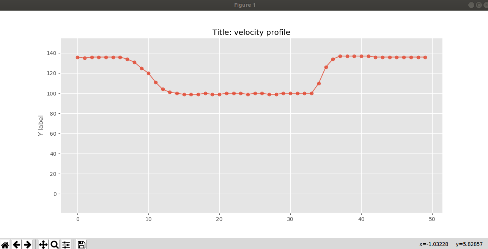

# ROS motor calibration
I have always been struggling with precise control of DC motors. This project is a template for further projects. It utilizes ROS to connect with any
microcontroller and motor. With a ktinker GUI and a real-time graph, the motor characteristics can be
evaluated and PD parameter can be changed in real-time. I have added an example MBED OS
project that I have used this with.
## Hardware
- Brushless or Brushed DC motor
- Hall or light effect sensor for speed measuring
- Microcontroller such as ARM M3/M4 (at least capable of running a real-time OS)
- Motordriver (L293 or an ESC for respectively Brushed or Brushless motors)
## Software
- ROS melodic
- gcc4mbed (C++ compiler for MBEDOS compatible with ROS)
- rosserial
## Repo structure
    ├── Pictures                                    # Results from the labs and project 
    ├── src                                        # Interupt I/O
          ├── python_classes
                    ├── UI.py                       # ktinker GUI window
                    └── globals.py                  # shared memory space
          ├── main.py                               # main
          └── vel_plot.py                           # plots the velocity in real time
## Starting the project (MBED OS)
Start a roscore
```
roscore
```
Start the ROS serial node for communication wit ARM Cortex (don't forget to source devel/setup.bash)
```
rosrun rosserial_python serial_node.py /dev/ttyACM0
```
Start the GUI and real-time plotter
```
python2.7 main.py vel_plotter.py
```
## Results
]
]
]


